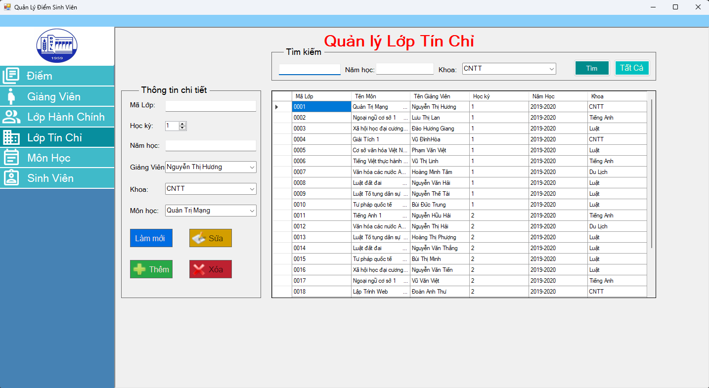
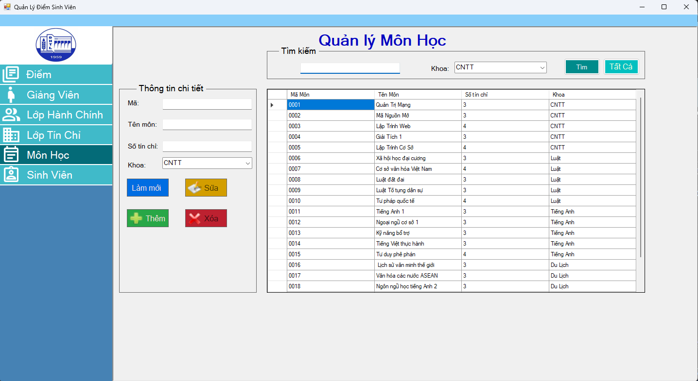

# Quản Lý Điểm Sinh Viên

## Giới Thiệu
Dự án **Quản Lý Điểm Sinh Viên** là một hệ thống quản lý dành cho trường học hoặc cơ sở giáo dục. Hệ thống giúp quản lý thông tin sinh viên, giảng viên, môn học, lớp hành chính, lớp tín chỉ, và điểm số của sinh viên. Được phát triển bằng ngôn ngữ C# và kết nối với cơ sở dữ liệu SQL Server, hệ thống cung cấp các chức năng thêm, sửa, xóa dữ liệu một cách dễ dàng và hiệu quả.

## Tính Năng
- **Quản lý Sinh viên**: Thêm mới, sửa thông tin, và xóa sinh viên khỏi hệ thống.
- **Quản lý Giảng viên**: Thêm mới, sửa thông tin, và xóa giảng viên.
- **Quản lý Môn học**: Thêm mới, sửa thông tin, và xóa các môn học.
- **Quản lý Lớp hành chính**: Quản lý thông tin lớp hành chính, giảng viên chủ nhiệm và sinh viên.
- **Quản lý Lớp tín chỉ**: Quản lý thông tin lớp tín chỉ, môn học, giảng viên phụ trách và sinh viên.
- **Quản lý Điểm số**: Theo dõi và cập nhật điểm số của sinh viên cho từng môn học.
- **Kết nối cơ sở dữ liệu SQL Server**: Hỗ trợ kết nối với SQL Server để lưu trữ và xử lý dữ liệu.

## Yêu Cầu Hệ Thống
- **Ngôn ngữ**: C#
- **Cơ sở dữ liệu**: SQL Server (phiên bản 2016 trở lên)
- **Môi trường phát triển**: Visual Studio 2019 hoặc mới hơn
- **Framework**: .NET Framework 4.7.2 hoặc mới hơn
- **Các thư viện/Package**: 
  - `System.Data.SqlClient` để kết nối và thao tác với SQL Server
  - Các package khác liên quan (nếu có)
## Ảnh minh họa

